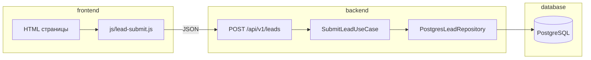

# Архитектура idm.io

Монорепозиторий с разделением по **Clean Architecture**: фронтенд, бэкенд и база данных — отдельные каталоги в корне.

```
idm.io/
├── frontend/          # Presentation (UI) — статический сайт
├── backend/           # Application + Domain + Infrastructure (API)
├── database/          # Схема PostgreSQL, миграции, сиды
├── docker-compose.yml # Локально: Postgres + API
├── TECHNICAL_SPEC.md
└── ANALYTICS.md
```

## Поток данных



## Слои backend

| Слой | Папка | Зависимости |
|------|--------|-------------|
| **Domain** | `backend/src/domain` | Ни от кого |
| **Application** | `backend/src/application` | Только domain |
| **Infrastructure** | `backend/src/infrastructure` | Domain (реализации) |
| **Presentation** | `backend/src/presentation` | Application, Infrastructure |

Правило: зависимости направлены внутрь — к domain.

## Контент

Сейчас услуги/кейсы/отзывы на фронте могут идти из mock или WordPress REST (`frontend/js/api.js`). Таблицы `services`, `cases`, `reviews` в БД подготовлены для будущего CMS/API.

## Деплой

| Часть | Куда |
|-------|------|
| Frontend | GitHub Pages (`/frontend`) или любой static host |
| Backend | VPS / Railway / Fly.io + `DATABASE_URL` |
| Database | Managed PostgreSQL или `docker compose` |
